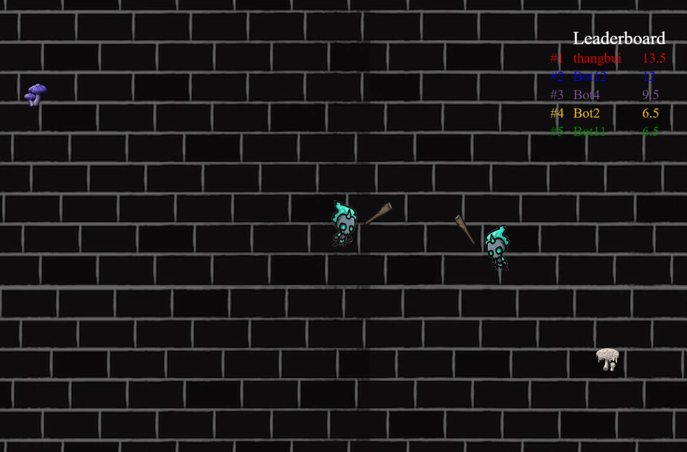
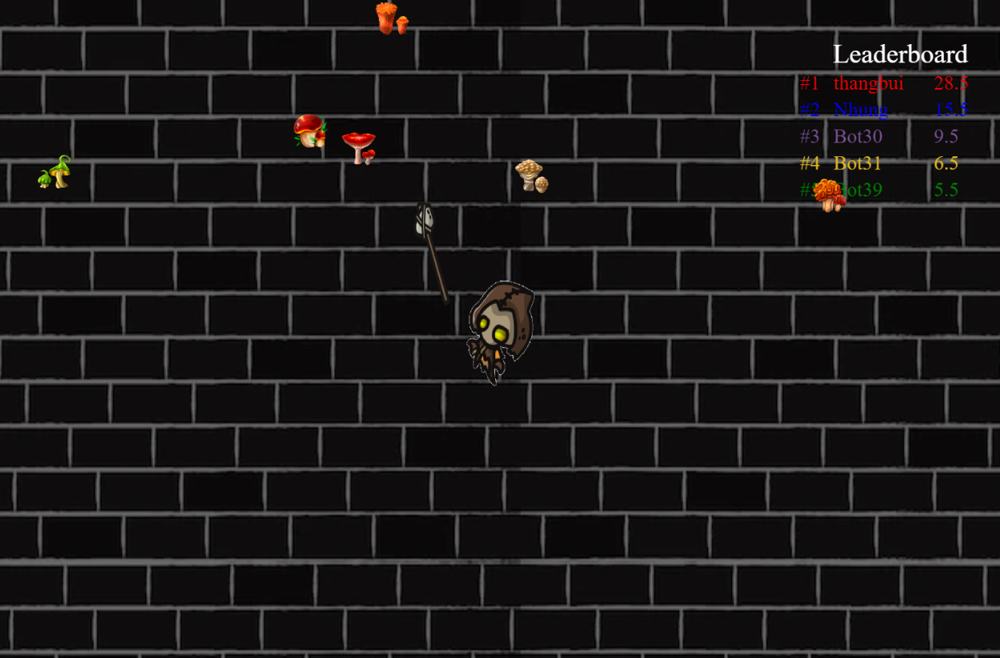
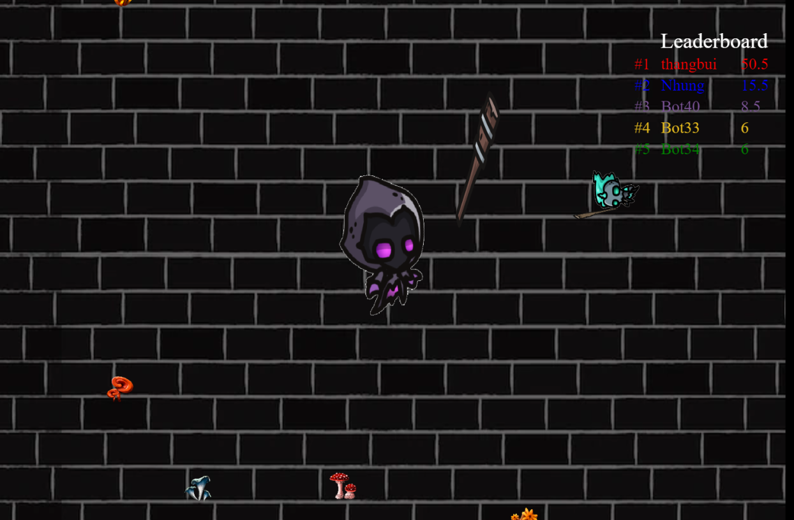

# Star War 
Star War is a fun multiplayer action game. Every time you level up, your character will evolve and your weapons and skills will also improve. You can level up by gathering energy by killing other players or eating mushrooms. In this game, it doesn't matter how big your opponent is, but how quickly you can get their weapons. But remember, the larger the opponent, the larger their attack range, so pay attention when approaching them. But the larger the opponent, the slower the speed will be. So take the opportunity to move on and fight!
## Demo




## Build using
- [Node Js](https://nodejs.org/en/)
- [Socket io](https://socket.io/)
- [Html](), [Css](), [Bootstrap](https://getbootstrap.com/)

## Getting Started
These instructions will get you a copy of the bot up and running on your local machine for development and testing purposes

### Prerequisites
- [Node Js](https://nodejs.org/en/) >= 14.0.0
- Npm >= 6.9.0
- [Git](https://github.com/)

### Installing
You will need to clone the repo to your machine then 
```
$ cd server
```
Install the dependencies
```
$ npm install
```
Run server
```
$ npm start
```
Before run front end you need to change url to connect local url in index.js file. Go to line 1 in index.js file and change 
`https://mysterious-brook-80094.herokuapp.com/` to  `http://localhost:3000`

Then run front end Folder by double click index.html file or open with Live Server in VSCode


